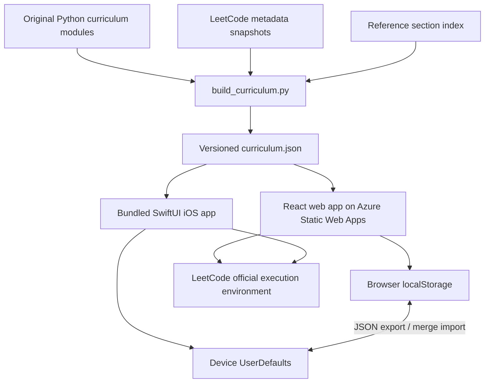

# Architecture

The web and native apps share **content and a portable progress format**, with native implementations of the UI and review scheduler.

## Content model

- A node has a stable ID and optional parent ID. Categories can nest to any depth; leaf nodes are individual patterns. Authored patterns have up to four levels; source practice collections may nest more deeply. A collection is a practice grouping, separate from an authored pattern.
- Every node carries a description, general approach, pitfalls, learning level, importance rationale, editorial priority, and reference links.
- An authored problem has factual LeetCode metadata, an original concise restatement, examples, input notes, a starter function, and implementations keyed to pattern IDs. Community problems preserve attributed MIT code and public signatures, with an official-statement link instead of a copied statement. Collection membership is separate from implementation pattern IDs.
- The relationship is many-to-many: a problem can have several patterns and each implementation teaches a particular pattern. This prevents a segment-tree implementation from masquerading as a Fenwick-tree lesson.
- `reference-index.json` stores external guide section associations. Extra section links are separate from curated local leaf assignments.
- `catalog.json` is a dated reference snapshot, not a claim that all entries have local solutions. Official tag metadata is optional, and unknown tags are never inferred from the title.

## Study behavior

Drafts and bookmarks are per problem. Recall state is per `problemId:patternId`. Revealing does not mark a problem as learned; two successful self-ratings are required for the “recalled twice” count. This is self-assessed recall, not proof of an accepted submission.

The transparent scheduler uses 10 minutes for Again, at least 1 day for Hard, at least 3 days for Good, and at least 7 days for Easy. Subsequent intervals scale from the prior interval. It is not presented as FSRS or as a scientifically calibrated memory model. Already-reviewed due cards precede unseen cards; sessions contain at most 10 cards.

Both apps read/write the same JSON backup shape (`version`, `cards`, `drafts`, `bookmarks`, `activity`). Imports validate before merging, keep existing local drafts, choose newer reviews, union bookmarks, and take the maximum daily count instead of double-counting imports. Invalid stored data has a recovery copy. There is no account, automatic synchronization, or backend storage of personal code.

## Execution and infrastructure

User code is never executed by this application. Python solution tests execute only checked-in authored code during development/CI. LeetCode links handle official statements, testing, and submissions.

Azure Static Web Apps serves the web build and read-only content files over HTTPS. The chosen tier is Free. No database, functions, virtual machine, or always-on server is needed. Both apps include the full catalog and source collection memberships. iOS embeds the same curriculum and can study fully offline; content updates ship with app builds. Device signing and App Store/TestFlight distribution require an Apple developer team and are separate from simulator verification.

The initial web bundle loads the editor only when a study card is opened. The Graphite theme uses system fonts. All state-changing controls use native HTML/SwiftUI elements. The app provides visible load/storage errors, invalid-backup errors, search empty states, and review completion states.

## Verification

`npm test` checks hierarchy integrity, every worked leaf mapping, web/iOS data parity, 200 authored examples, seeded differential checks for subtle algorithms, scheduling, filtered queues, and backup validation. Playwright tests the desktop and mobile web flow. XCTest tests native decoding/storage/scheduling and an actual UI reveal/rating flow on Simulator. See [VALIDATION.md](VALIDATION.md) for the latest observed run.
